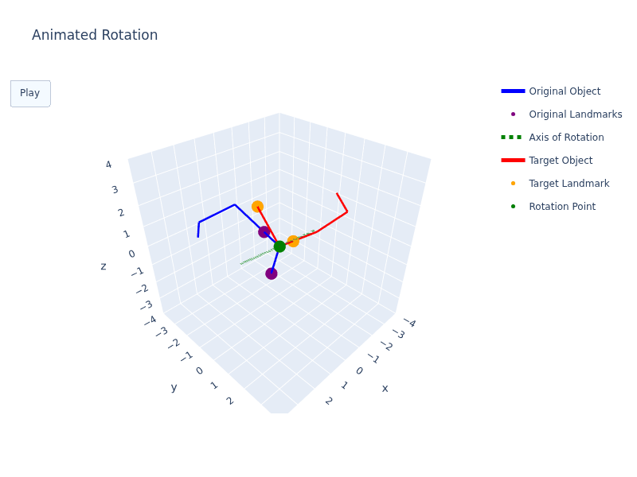

# MentalRotationModel

This repository contains the source code for
my Masters thesis, <i>Extending Computational Models of Mental Rotation
Through Axis Identification</i>, completed at Carleton University in 2026.

Experimental data from Ganis & Kievit (see https://doi.org/10.5334/jopd.ai) and Jost & Jansen (see https://doi.org/10.1080/13875868.2020.1754833) is present in this repository.

## Thesis Abstract

Mental rotation is an essential cognitive ability for everyday functioning that is often used to assess spatial cognition. Although mental rotation has been studied extensively, few computational models explicitly account for the cognitive processes involved, and none identify a rotation axis before rotation begins. This thesis proposes a novel theory and computational model that performs Shepard-Metzler mental rotation decision tasks by determining a rotation axis from visual information before mental rotation occurs. The model uses geon-based object representation and landmarking steps to estimate an initial rotation axis, which is updated throughout the rotation using a dynamic stepwise strategy. This approach allows the model to perform rotations around both cardinal and compound axes without requiring the axis to be predefined, while also accounting for the possibility of an initially misperceived axis of rotation. The model was evaluated using two independent datasets of human mental rotation experiments and successfully reproduced the linear relationship between reaction time and angular disparity while closely matching human reaction time distributions (both r ≥ 0.99). These findings suggest that explicit axis identification is an important cognitive component of mental rotation. Future work should evaluate the model on rotations involving simultaneous combinations of cardinal axes, further investigate the landmarking process, and explore additional sources of variability in human performance.

Feel free to email me at [mohlrachael@gmail.com](mailto:mohlrachael@gmail.com) for more information on this project.
